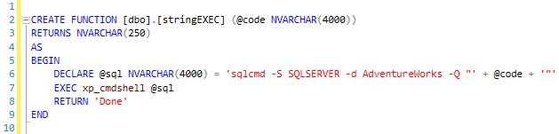
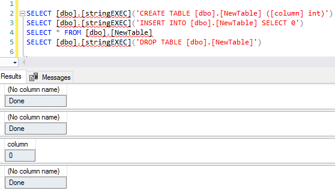

*Breaking out of limitations imposed by Microsoft on user-defined functions in SQL Server.*


Do you know what's the first thing Microsoft tells you in their [Create User-defined Functions](https://docs.microsoft.com/en-us/sql/relational-databases/user-defined-functions/create-user-defined-functions-database-engine?view=sql-server-2017) article?
It's this:
```
Limitations and restrictions
- User-defined functions cannot be used to perform actions that modify the database state.
```

What that means, primarily, is that you can't CREATE, DROP, or INSERT into tables and you can't execute your Stored Procedures. It also means that you can't execute any dynamic SQL from within your function, even if it wouldn't modify any data. Very limiting.

Well, **no more**. I give you `SELECT [dbo].[stringEXEC]('DROP TABLE [dbo].[AnyTable]')` function to run any SQL code from within your other user-defined functions.





**To run this from within an actual function, use this approach:**
```
DECLARE @res VARCHAR(4) = (SELECT [dbo].[stringEXEC]('CREATE TABLE [dbo].[anyTable] ([result] nvarchar(max))'))
```

**Note:** This is a terrible idea. Please try to find another way for use in production environments. You have been warned.
